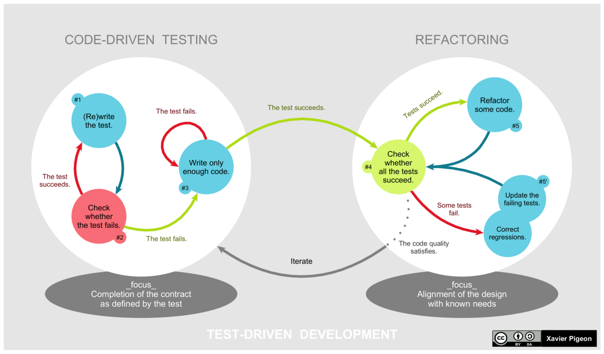

# Demo - Unit Test

## Pourquoi mettre en place des tests unitaires ?
- Automatiser la procedure de test.
    - Garder toutes vos procedures de tests
    - Permet de relancer tous les tests après une modification
- Réaliser des tests ciblés sur une fonctionnalité.
- Eviter une régression (Casser l'app).

## Mise en place des tests unitaires en C#
Trois librairies dispo : 
 - MSTest
 - NUnit
 - xUnit *<- Utiliser pour le cours*

Structure d'une solution avec des tests : 
```
/Demo_Test
  /Demo_Test
    /Utils
      MathUtils.cs
    Program.cs
  /Demo_Test.Test
    /Utils
      MathUtilsTest.cs
```

Ecrire un test avec xUnit, il est necessaire d'ajouter un attribut à la méthode
 - Fact     : Méthode de test simple
 - Theory   : Méthode de test avec des parametres

## Principe de Test Driven Development (TDD) 
1) Ecriture des tests
2) Vérifier que les tests echouent
3) Réaliser le code necessaire pour que les tests fonctionne
4) Vérifier que les tests réussissent (sinon, retour etape 3)
5) Refactorisation du code
6) Vérifier que les tests réussissent (sinon, retour etape 5)
7) Nouvelle fonctionnalité et on repart de l'etape 1



